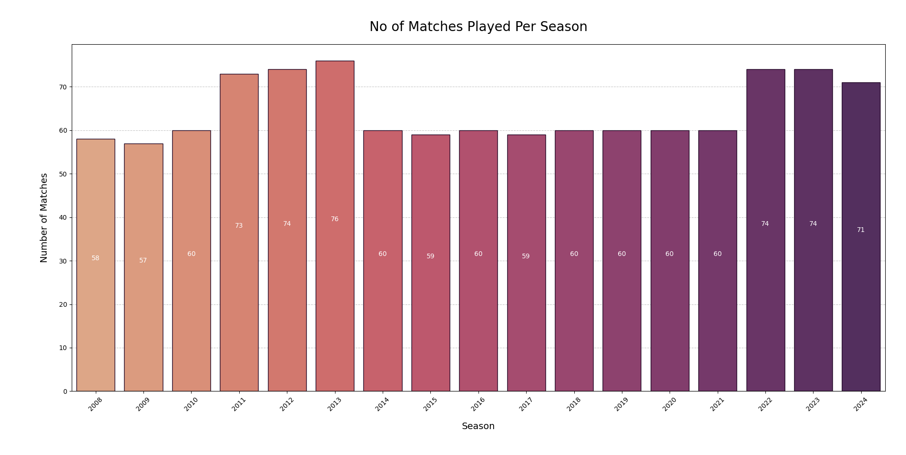
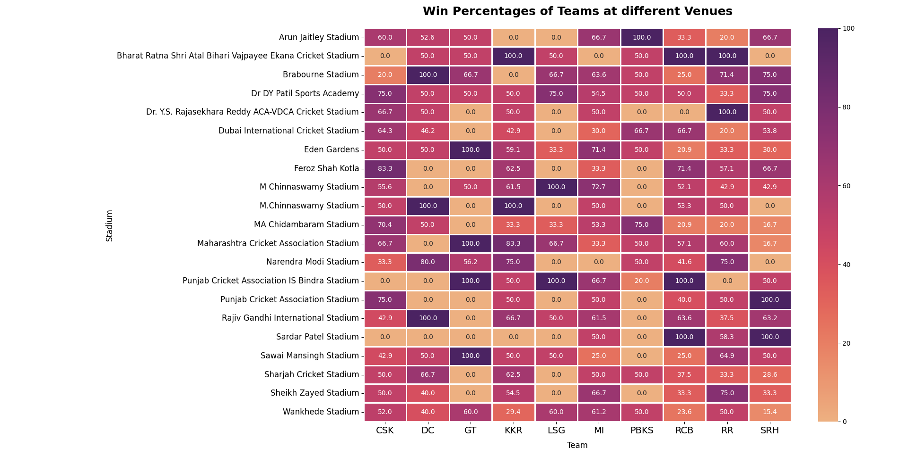
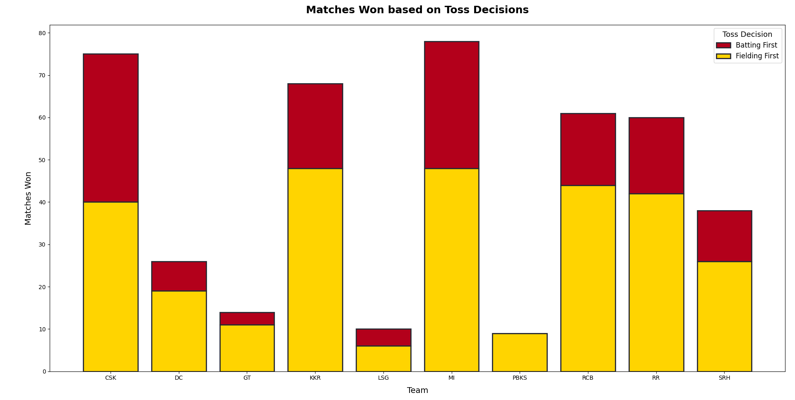
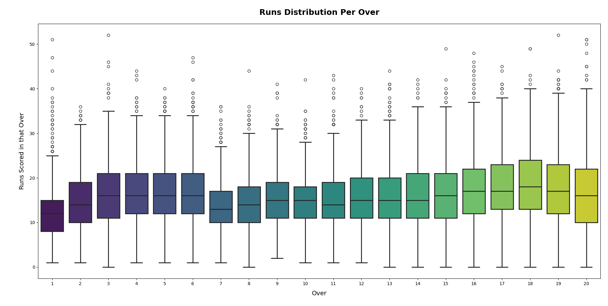
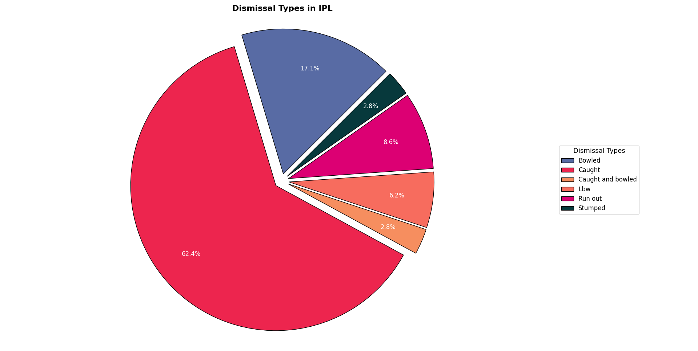

# IPL Analytics 2023–2024

This project explores match-level and player-level trends in the Indian Premier League using datasets up to 2024.

## 📁 Datasets Used
- Match Data (2008–2024)
- Player Data (2008–2024)

## 🗒️ NOTE
- This project provides a detailed analysis of IPL data until 2024. 
  The 2008–2024 dataset was used for  match-level insights including toss decisions, team wins percentage and venue impacts.

## 📊 Analysis Covered

- **The number of matches steadily increased from 2008**, 
  reaching a peak in later seasons, indicating the league's growing popularity.

- **Teams that chose to field first after winning the toss generally had a slightly better win ratio** than those 
  opting to bat first.

- **The death overs (16-20) show a noticeable spike in run scoring**, especially overs 18 and 19, where batters typically 
  target aggressive hitting.

- **Some teams show clear home-ground advantages**, winning a significantly higher percentage of matches at specific venues.

- For example, CSK has a very high win rate in Chennai, indicating the importance of familiar pitch conditions 
  and crowd support.

- Certain teams like MI and CSK maintain consistent win percentages across seasons, 
  which shows strong team management and player consistency.

- **Caught is the most frequent mode of dismissal**, typical due to aggressive shot-making.

- The relatively high number of bowled and LBW dismissals indicates that quality bowling—especially 
  yorkers and spin is still highly effective in matches.

## 📈 Visualizations

Here are some charts generated in this project:

## 📂 Project Structure
- `/data` – Raw CSV datasets
- `/scripts` – Python Scripts
- `/images` – Graphs & visuals

## 🛠️ Tech Stack

- 🐍 Python
- 🧮 Pandas & NumPy
- 📊 Matplotlib & Seaborn
- 🧠 Jupyter Notebook

## 📁 Dataset Source

https://www.kaggle.com/datasets/patrickb1912/ipl-complete-dataset-20082020

## ✅ How to Run

1. Clone the repo  
2. Open `match_analysis.ipynb` and `player_analysis.ipynb` in Jupyter or Colab
3. If you want you can run it in other IDEs like Pycharm and VSCode , just run the `match_analysis.py` file or
   `player_analysis.py` file
4. Just uncomment each analysis function that you want to run

## 🙋‍♂️ Author

Made with 💙 by Yuv Bhatt (https://github.com/YuvBhatt-YB)

## 📌 License

This project is for educational and portfolio purposes only.